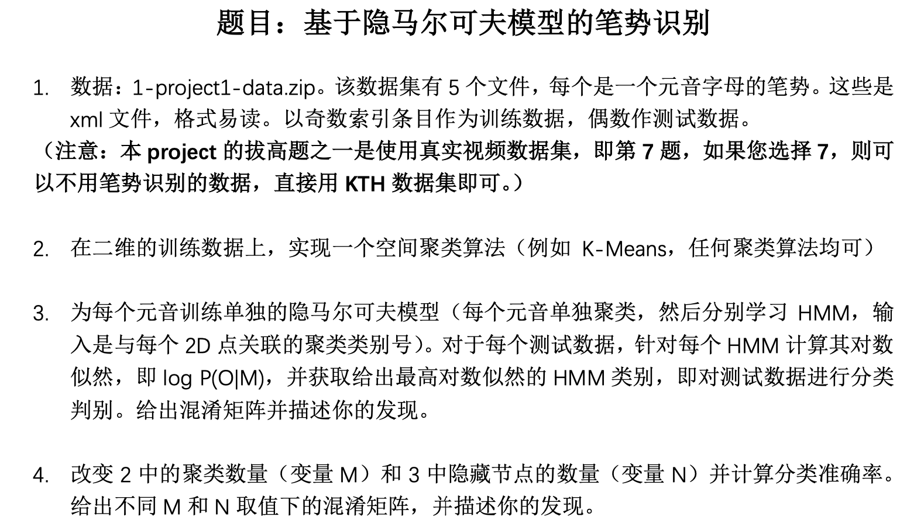
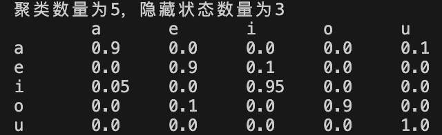

# 《模式识别与机器学习》课程设计

## 题目

## 实现

第一题：`data.py`

第二题：`kmeans.py`

第三题：`hmm.py`

第四题：改变 `kmeans.py` 中的 `K` 和 `hmm.py` 中的 `n_states` 即可

`p12.ipynb` 是第1、2题的notebook，`p34.ipynb` 是3、4题的notebook

## 效果

得到混淆矩阵

## 说明

本人码力有限，如有问题，欢迎交流
